# hi there, i'm **Max** :D

I build things because I love building and solving puzzles.

Some projects start from boredom, some from problems, others from obsession, but they all teach me something new.

Most nights you'll find me working on half-finished ideas with jazz in the background and a notepad full of project sketches.

> *"The next time I see a glass wall, I won't just smash my head against it. I'll see it for what it is: a problem waiting for a solution. And then I'll build the tool to shatter it."*

[🌐 website](https://maximusadeola.com) · [✉️ resume](https://github.com/MaxDevv/MaxDevv/blob/main/Resume.pdf) · [💬 open issue to chat](https://github.com/MaxDevv/MaxDevv/issues/new)

---

## ✨ featured projects

<table>
<tr>
<td width="50%" valign="top">

### 🧠 [Un-LOCC](https://github.com/MaxDevv/Un-LOCC)
Universal Lossy Optical Context Compression for VLMs — encodes text *as images*, achieving ~3× compression at ~93% retrieval accuracy. Built custom "Optical Needle-in-a-Haystack" evaluations for 90+ model runs.

---

### 🌊 [FlashySurf](https://github.com/MaxDevv/FlashySurf)
A passive-learning browser extension that slips spaced-repetition flashcards into normal browsing. Open-source, free, and now supports AI-generated decks & custom subjects.

---

### 🧬 [Freshly-Baked-AI](https://github.com/MaxDevv/Freshly-Baked-AI)
Experiments with evolving polynomial functions instead of neural networks — no layers, no gradients, just math finding its own shape.

</td>
<td width="50%" valign="top">

### 🩺 [Curing-Cancer](https://github.com/MaxDevv/Curing-Cancer)
Mining thousands of patient stories to spot early-stage cancer patterns hidden in plain text. Currently prototyping a risk-screening form trained on real anecdotes.

---

### 📱 [pressurize.js](https://github.com/MaxDevv/Pressurize.js)
Turns accelerometer data into "pressure-sensitive" input — no hardware required. Perfect for a web based instrument!

---

### 🎶 [Melodre](https://github.com/MaxDevv/Melodre)
A rhythm-based ear-training web app that turns practice into a game. Intervals + speed + point systems = fun learning magic ✩

</td>
</tr>
</table>

---

## 🧰 toolbox & stats

**core:** Python · JavaScript · Linux · Node · Git  
**web:** Svelte · Vite · React · Tone.js  
**ai/ml:** OpenRouter & OpenAI SDK · embeddings · TensorFlow / PyTorch · NEAT
**infra:** Chrome extensions · npm packages · JSON APIs · automation scripts

  
  
  
  
  

 

  
  

 

---

## (´• ω •`)✿ outside of code

- 🎸 **jazz guitarist** — Super modded guitar; School Jazz Combo guitarist; Secretly loves Math Rock
- 🧑‍🏫 **teacher** — helped kids at 3D-printing / robotics camps, fixed machines, and wrote docs so others could too
- 🧩 **puzzle-maker** — CS Club officer who made weekly algorithm challenges and automation tools

> *Maximus* means "greatest" — and I'll live up to my name :D
> 
> I'll learn everyting and never stop growing. Because greatness isn't a destination, it's the pursuit itself (ง •̀_•́)ง

 

---

## let's talk (・ω・✿)

You can [open an issue](https://github.com/MaxDevv/MaxDevv/issues/new) or just drop a hi.  
I love chatting about *learning systems, interesting new tech, project ideas, and making practice feel like play.*  
Also jazz. I love Jazz. (´｡• ᵕ •｡`)

---

Profile metrics generated using [lowlighter/metrics](https://github.com/lowlighter/metrics)
